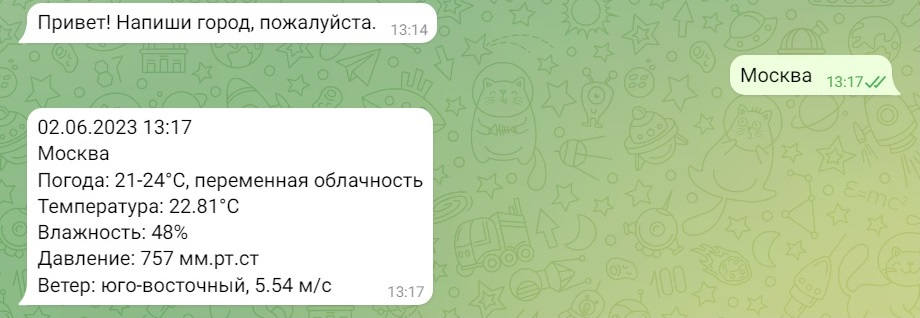
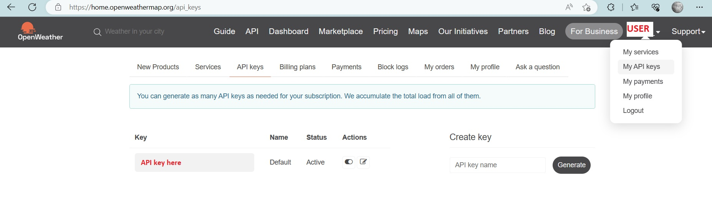

# weather_bot

Телеграмм бот, показывающий погоду в указанном городе.  
В чате достаточно ввести название города на русском языке и бот выдаст основную сводку погды в настоящее время.  



Для получения сводки погоды бот обращается к API ресурса https://home.openweathermap.org  
На сервисе необходимо зарегистрироваться и получить APIKey, 
который бот отправляет при обращении к API в параметрах запроса.  



### Инструменты
- Python 3.7>
- python-telegram-bot 13.7 (асинхронная версия 20. будет применена в дальнейшей разработке)

### Запуск прокта
Клонировать проект, перейти в директорию проекта

```shell
git clone https://github.com/mikepavlos/weather_bot.git
cd weather_bot
```

Установить и активировать виртуальное окружение, установить зависимости.  
Для Windows:

```shell
python -m venv venv
venv/scripts/activate
python -m pip install -U pip
pip install -r requirements.txt
```

Для *Unix
```shell
python3 -m venv venv
source venv/bin/activate
python3 -m pip install -U pip
pip install -r requirements.txt
```

Заполнить файл `.env.example` согласно комментариям в нем, переименовать в `.env`.  
Запустить проект из IDE (`run`) или в консоли ```python weather.py```.  

В проекте применяется автоматическое тестирование при `push` в главную ветку репозитория 
и отправка сообщения об успешном прохождении тестов в чат телеграм.  
Для получения телеграм сообщения необходимо после создания репозитория добавить для GitHub Actions телеграм-данные в переменные Secrets.  

```text
<Проект> -> Settings -> Secrets and variables -> Actions -> New repository secret
```

TELEGRAM_TO - id телеграм-чата (узнать в чате: @userinfobot; или взять из своего `.env`)  
TELEGRAM_TOKEN - токен телеграм-бота (узнать: @BotFather -> /mybots -> Choose a bot -> API Token; или взять из своего `.env`  

В работе приложения применяется логирование. Логи отправляются в основной поток (консоль), 
а также сохраняются в корне проекта в файл `program.log`. При превышении определенного размера файла, логи перезаписываются.  

### Проект в разработке
- добавить тестирование
- в дополнительной ветке проработать асинхронную версию

### Автор
Михаи Павлов (mihalis)  
email mike_pavlovsky@hotmail.com  
telegram @miha1is
